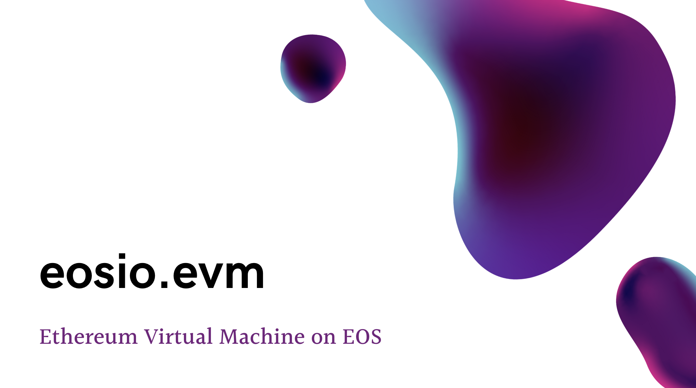

[](#)

## Benchmarks
| Action         | CPU Cost      |
| -------------  |:-------------:|
| ERC20 Transfer | 504µs [(TX)](https://jungle.bloks.io/transaction/eb2d83e1ed04b98d1c7767acae5df174de56ee51a2bf6d1c06a8a863f9b98ca0)|
| ERC20 Deploy   | 764µs [(TX)](https://jungle.bloks.io/transaction/074f2cb4435173293243e4350a9a3faa12e5fb639780aaabb79ad68fb2c813e8)      |
| EVM Transfer   | 325µs [(TX)](https://jungle.bloks.io/transaction/640c061cbd717b08b8af1c28129be1ef7365d1810fc285313a55d44f2271e312)      |
| EVM New Address| 553µs [(TX)](https://jungle.bloks.io/transaction/876ce02ccdc7fd7338fcf9e9fea6ea9e4575211209fe29c88ec33eb63584be84)     |

## Disclaimer 

The code in this repository has not been audited by a professional audit firm. Please use at your own discretion and risk. The author takes no responsibility for any material or inmaterial losses from any form of operation or deployment of the software within this repository.

## Achievements
- Full Javascript SDK for deploying, executing and querying contracts
- 100% Success on Ethereum Transaction Tests
- 100% Success on Ethereum RLP Tests
- REVERT support (challenging on EOS as it requires no use of eosio::check after nonce increment)
- Istanbul support
- Full gas cost calculations (not billed to sender unless flag enabled)
- Web3-similar call support (query view functions with no state modifications)
- All precompiles supported

## Precompile support
eosio.evm supports all 9 precompiles
1. ec_recover
2. sha256
3. ripemd160
4. identity
5. expmod
6. bn_add
7. bn_mul
8. bn_pairing
9. blake2b

## Constants
All constants are found at [constants.hpp](eosio.evm/include/eosio.evm/constants.hpp)

1. **TESTING** - adds functionality for executing tests, and resetting the contract; default true, remove in production
2. **BN_CURVE** - adds bnadd, bnmul, and bnpair precompiles; default true
3. **CHARGE_SENDER_FOR_GAS** - toggle charging sender for gas; default false, required for ethereum tests
4. **PRINT_LOGS** - prints logs as part of execution receipt; default false
5. **OPTRACE** - prints the opcode trace for the execution; default false
6. **PRINT_STATE** - prints the state when saved or loaded from tables; default false
7. **TOKEN_SYMBOL_CODE_RAW** - the symbol of the core token on-chain; default "EOS"
8. **TOKEN_CONTRACT_RAW** - the contract of the core token on-chain; default "eosio.token"
9. **TOKEN_PRECISION** - the precision of the core symbol on-chain; default 4

**NOTE:** [TESTING, CHARGE_SENDER_FOR_GAS] must be enabled, and [OPTRACE, PRINT_LOGS] must be disabled for ethereum/tests testing to pass successfuly.

**NOTE:** If ec_add, ec_mul and ec_pairing precompiles are required, set BN_CURVE to true (will increase WASM size by 210KB, or ~2MB onchain).

## Usage instructions
Deployment steps are laid out step-by-step in both the JS and cleos guides:

**JS Guide:** [eos-evm-js guide](https://github.com/jafri/eosio.evm/tree/master/eos-evm-js)

**Cleos Guide:** [cleos guide](https://github.com/jafri/eosio.evm/tree/master/CLEOS-GUIDE.md)

**Basic Guide:** Simply deploy the WASM and ABI at [eosio.evm/eosio.evm/eosio.evm.wasm](eosio.evm/eosio.evm/eosio.evm.wasm) and [eosio.evm/eosio.evm/eosio.evm.abi](eosio.evm/eosio.evm/eosio.evm.abi)

It is important that any node that you deploy the contract to is running EOSVM OC through the `--eos-vm-oc-enable` option

## Ubuntu 18.04 Build Instructions
#### 1. Install Pre-Requisites
```
sudo apt install make
sudo snap install cmake --classic
sudo apt install build-essential
```

#### 2. Install eosio and eosio-cdt
```
wget https://github.com/eosio/eos/releases/download/v2.0.4/eosio_2.0.4-1-ubuntu-18.04_amd64.deb
sudo apt install ./eosio_2.0.4-1-ubuntu-18.04_amd64.deb

wget https://github.com/eosio/eosio.cdt/releases/download/v1.7.0/eosio.cdt_1.7.0-1-ubuntu-18.04_amd64.deb
sudo apt install ./eosio.cdt_1.7.0-1-ubuntu-18.04_amd64.deb
```

For other platforms than Ubuntu 18.04, check [eos](https://github.com/EOSIO/eos) and [eosio.cdt](https://github.com/EOSIO/eosio.cdt)

**Note:** You must build eos from source if you wish to manually build the unit tests in eosio.evm

#### 3. Clone eosio.evm and build contract
```
git clone https://github.com/jafri/eosio.evm
cd eosio.evm
cmake .
make -j4
```

If you wish to build tests, use `cmake . -DBUILD_TESTS=true`

If not set automatically, you may need to manually set BOOST_ROOT to the directory of your boost installation.

#### 4. Run tests (optional, take long time)
[tests/eosio.evm_tests.cpp](tests/eosio.evm_tests.cpp) has five types of tests, which can each be turned on or off individually:

```cpp
const bool base_enabled              = false;  // Base testing of linking EOS account
const bool erc20_enabled             = false;  // Test ERC20 contract deployments
const bool erc721_enabled            = false;  // Test ERC721 contract deployments
const bool transaction_tests_enabled = false;  // Test ethereum/tests TransactionTests
const bool state_tests_enabled       = true;   // Test ethereum/tests GeneralStateTests
```

In [constants.hpp](eosio.evm/include/eosio.evm/constants.hpp), TESTING must be enabled to seed initial state of accounts and CHARGE_SENDER_FOR_GAS must be enabled if using unmodified ethereum/tests since tests will only match post-state balances if gas is charged.

If using modified tests to account for no gas being charged, simply ensure CHARGE_SENDER_FOR_GAS is set to false (default), and replace the default path `jsontests/BlockchainTests/GeneralStateTests` in [eosio.evm_tests.cpp](tests/eosio.evm_tests.cpp) with the path to the modified tests.


**Running tests:**
```sh
cd tests
make -j4
./unit_test # Non-verbose
./unit_test -- --verbose # Expanded logging
```

## Directory structure
- eosio.evm: contains all contract code
  - src: all sourcefiles
  - include/eosio.evm: all headerfiles
  - external: external libraries
- eos-evm-js: Full JS SDK for deploying both EVM and Ethereum accounts, contracts, fetching state, etc.
- evm-mock-rpc: Mock Ethereum RPC server to enable interoperability with Metamask, Remix, etc.
- tests: full Ethereum/EOS tests
  - jsontests: copy of https://github.com/ethereum/tests
  - system_wasms: eosio.system and eosio.token ABIs/WASMS
  - eosio.evm_tests.cpp: testing suite


## Contract Public Actions
```c++
ACTION raw ( const eosio::name& ram_payer,
             const std::vector<int8_t>& tx,
             const std::optional<eosio::checksum160>& sender);
```
- `ram_payer` Name of account paying for RAM costs
- `tx` will take a raw Ethereum transaction RLP hex encoded without the '0x' prefix
- `sender` is an optional parameter used when the `tx` is not signed
&nbsp;

```c++
ACTION create ( const eosio::name& account,
                const std::string& data);
```
- `account` is the EOSIO account creating the new Ethereum account
- `data` is an arbitrary string used as a salt to create the new Ethereum account
&nbsp;

```c++
ACTION withdraw ( const eosio::name& to,
                  const eosio::asset& quantity);
```
- `account` is the EOSIO account associated with an Ethereum account with a balance
- `quantity` is an EOSIO asset like "4.0000 SYS" for the amount to withdraw
&nbsp;

```c++
[[eosio::on_notify("eosio.token::transfer")]]
void transfer( const eosio::name& from,
                const eosio::name& to,
                const eosio::asset& quantity,
                const std::string& memo );
```
- Standard transfer function used to deposit balance into associated Ethereum account. If the depositor does not have an EVM account associated, the transaction will fail to execute.
&nbsp;
```c++

ACTION call( const eosio::name& ram_payer,
             const std::vector<int8_t>& tx,
             const std::optional<eosio::checksum160>& sender );
```
- Function to mock execute and view result (no state modifications are persisted), similiar to Web3 call()
&nbsp;


## Contract Tables
```c++
struct Account {
  uint64_t index;
  eosio::checksum160 address;
  eosio::name account;
  uint64_t nonce;
  std::vector<uint8_t> code;
  bigint::checksum256 balance;
}
```
- `index` - auto-incremented counter for accounts, also used as scope index for AccountStates
- `address` - Ethereum 160 bit address
- `account` - EOSIO account associated with Ethereum account
- `nonce` - Current nonce of the account
- `code` - Contract code for Ethereum account if present
- `balance` - 256 bit balance stored as a bigint (shows as big endian when printed). The precision is 10^18 as specified in Ethereum whitepaper. Therefore, 1 EOS is represented as 1000000000000000000, which is de0b6b3a7640000 in big-endian hex.

```c++
struct AccountState {
  uint64_t index;
  eosio::checksum256 key;
  bigint::checksum256 value;
}
```
- `index` - auto-incremented counter for account states, only used as primary key
- `key` - big-endian encoded key for storage
- `value` - big-endian encoded value for storage


## EVM Notes
- Account and code tables were merged to match the specification in the Ethereum Yellow Paper
- Account States are scoped by the index of the account. The index of an account never changes, thus this is guaranteed to be unique.
- NUMBER opcode returns tapos_block_num, as that is the only EOSIO block number available to contracts
- The RLP encoding in "create" uses RLP (uint64_t eos_account, uint64_t nonce)
- No patricia merkle tree is used
- The balance value is printed in explorers, etc as a big-endian hex value with a precision of 10^18, as specified in Ethereum yellow paper. Therefore, 1 EOS is represented as 1000000000000000000, which is de0b6b3a7640000 in big-endian hex.

## Special Mentions
- Eddy Ashton for his work on [enclave-ready EVM (eEVM)](https://github.com/microsoft/eEVM)
- Pawel Bylica for his work on pushing the speed limits of EVMs with [evmone](https://github.com/ethereum/evmone)
- winsvega for his continous work maintaining [Ethereum Tests](https://github.com/ethereum/tests)


### Disclosure
Note that this repository is still in a highly iterative state, if you find any bugs, please open an issue or a pull request.